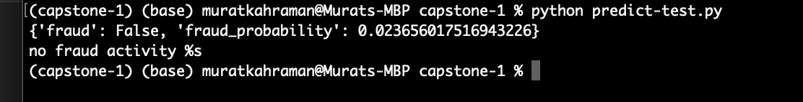

# Credit Card Fraud Detection Dataset

## Problem Description

The primary objective of this dataset is to facilitate the development of fraud detection algorithms and models to identify potentially fraudulent transactions.

## About the Dataset
 
This dataset contains credit card transactions made by European cardholders in the year 2023. It comprises over 550,000 records, and the data has been anonymized to protect the cardholders' identities. 

## How to Use 

### Prerequisites

```python
python
git
docker
linux
```

### Cloning the repo

First and foremost, the repo needs to cloned to local for usage. This can be achieved using:

```python
git clone https://github.com/kahramanmurat/ml-zoomcamp-capstone-1.git
```

### Acquiring Data

To access the dataset used for this project, please follow these steps:

1. Go to the following link to download the dataset:
   [Credit Card Fraud Detection Dataset](https://www.kaggle.com/datasets/nelgiriyewithana/credit-card-fraud-detection-dataset-2023/data)

2. Click on the provided link to visit the Kaggle dataset page.

3. Download the dataset from the Kaggle platform.

Please note that the dataset file is approximately 330MB in size, so ensure you have sufficient storage space and a stable internet connection for the download.

Once you have downloaded the dataset, you can proceed with the project by using the acquired data for analysis and modeling.

### Using Docker Image

```
docker build -t {build-tag} .
```

```
docker run -it -p 9696:9696 {build-tag}
```

`{build-tag}`: Specifies any user-defined tag for docker image. eg. `credit-card`

### Making predictions

By default, the patient parameters are set at:

```
    "id": 1000.0,
    "v1": -0.2639028698066069,
    "v2": -0.1525732764811688,
    "v3": 0.1827283788981841,
    "v4": -0.2534167407096296,
    "v5": 0.5818938643664141,
    "v6": -0.1041843872649159,
    "v7": 0.6308849984849844,
    "v8": -0.1389866725243075,
    "v9": 0.395914495624555,
    "v10": 0.9327688331096036,
    "v11": -1.659171142405512,
    "v12": 0.560241374664014,
    "v13": 0.4251851845057326,
    "v14": 1.0202572328560644,
    "v15": 0.9065666056755164,
    "v16": 0.3618075730347657,
    "v17": 0.3311917170669856,
    "v18": 0.4033939107572041,
    "v19": 0.4208006255758966,
    "v20": -0.5657466084016877,
    "v21": -0.1125122582376631,
    "v22": 0.4464000053015059,
    "v23": 0.5268629462331915,
    "v24": -0.7425215709105263,
    "v25": -0.7035976891581637,
    "v26": -0.8576888198591994,
    "v27": -0.0157900366683944,
    "v28": 0.3666313324560797,
    "amount": 8273.81
```
User may change the parameters to test out different scenarios by changing values or parameters in `predict-test.py`

Once, user is happy with credit card transaction input, predictions can be made in a new console window inside the project folder.

```python
python predict-test.py
```

## Sample Output

Locally, user should be able to get a similar output to the one shown below upon running all steps successfully.



## Acknowledgement

The project has been possible with the help of a colaborative slack community of DataTalks and specially Alexey.

## Feedback

I am open to feedback from everyone as I am still learning and seeking ways to improve. Please provide a star incase you liked my work.